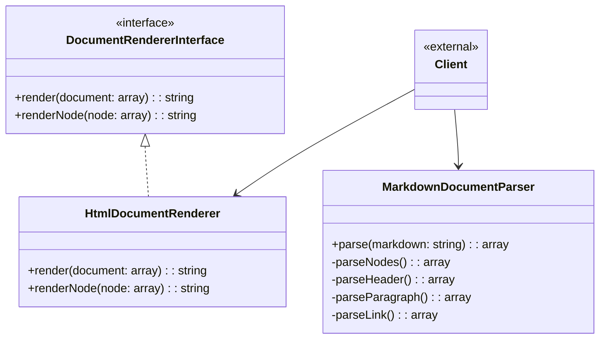

# Package Design



## Flow Description

1. Clients create instances of `MarkdownDocumentParser` and `HtmlDocumentRenderer`
2. Use `MarkdownDocumentParser` to convert markdown text into an AST (Abstract Syntax Tree)
3. Pass the AST to `HtmlDocumentRenderer` to generate HTML output
4. `HtmlDocumentRenderer` implements `DocumentRendererInterface` allowing for other renderers in future

## Usage Example
```php
use Acme\TextTools\Markdown\MarkdownDocumentParser;
use Acme\TextTools\Markdown\HtmlDocumentRenderer;

$parser = new MarkdownDocumentParser();
$renderer = new HtmlDocumentRenderer();

// Parse markdown into AST
$ast = $parser->parse($markdownText);

// Render AST to HTML
$html = $renderer->render($ast);
```
